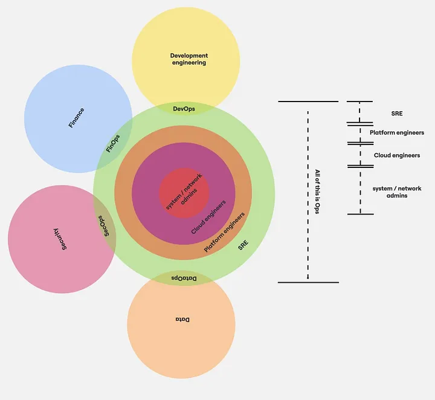

# SRE Manifesto

**A practical definition of Site Reliability Engineering, outside any strict definitions made by Google or any other company.**

This is opinionated. It's grounded in 30+ years of operational experience across infrastructure, platform engineering, and people leadership.

---

## SRE Is a Role, Not a Team

SRE is not a department you create alongside Development. It's a **specialization within Ops** — the outermost ring of a concentric model of operational disciplines.

Every company that has tried to make SRE a standalone team disconnected from Ops has ended up with a team that either:
- Becomes a second platform team with a fancier title, or
- Gets pulled into development work and stops doing operations

SRE is Ops. Specifically, it's Ops with software engineering applied to operational problems.

---

## The Concentric Model

Operations disciplines nest inside each other. Each outer layer includes the skills and responsibilities of all inner layers.

```
┌─────────────────────────────────────────┐
│  SRE                                    │
│  ┌───────────────────────────────────┐  │
│  │  Platform Engineers               │  │
│  │  ┌─────────────────────────────┐  │  │
│  │  │  Cloud Engineers            │  │  │
│  │  │  ┌───────────────────────┐  │  │  │
│  │  │  │  System / Network     │  │  │  │
│  │  │  │  Admins               │  │  │  │
│  │  │  └───────────────────────┘  │  │  │
│  │  └─────────────────────────────┘  │  │
│  └───────────────────────────────────┘  │
└─────────────────────────────────────────┘
          ALL OF THIS IS OPS
```

### System / Network Admins
The core. Hardware, networking, operating systems, storage. The foundation everything else is built on. This knowledge doesn't go away just because you moved to the cloud.

### Cloud Engineers
System admin skills + cloud platform expertise. Infrastructure provisioning, cloud networking, managed services. They understand the cloud provider deeply enough to make infrastructure decisions.

### Platform Engineers
Cloud engineer skills + developer tooling and internal platforms. CI/CD pipelines, developer self-service, internal developer platforms. They build the paved road that development teams drive on.

### SRE
Platform engineer skills + software engineering applied to operational problems + **standby**. They automate operational work, build reliability tooling, define and track SLOs, carry the pager, and respond to production incidents.

---

## The Adjacent Disciplines

These are not part of the concentric Ops model — they're **overlapping circles** that bridge Ops with other domains.

### DevOps
The overlap between **Development Engineering** and **Ops** (specifically SRE and Platform). DevOps is a cultural and process bridge — it's about how Dev and Ops work together, not a job title. When companies hire "DevOps Engineers", they usually mean Platform Engineers or SREs.

### FinOps
The overlap between **Finance** and **Ops**. Cloud financial management — cost allocation, optimization, showback/chargeback, forecasting. Requires understanding of both cloud infrastructure and financial operations.

### SecOps
The overlap between **Security** and **Ops**. Operational security — runtime security monitoring, incident response for security events, compliance automation. The operational side of the security function.

### DataOps
The overlap between **Data** and **Ops**. Data pipeline reliability, data infrastructure management, data quality monitoring. Applying operational discipline to data systems.

---

## The Standby Differentiator

If you want a single test for whether someone is doing SRE work: **are they on standby?**

SRE carries the pager. SRE is the **primary on-call rotation** for production outages. Platform teams and sysadmins are on secondary rotation. Escalation goes through the appropriate path to the appropriate team's standby person.

Platform and Ops teams have their own standby schedules. But SRE is the first line for production reliability.

If your "SRE team" doesn't do standby, they're a platform team with a marketing problem.

---

## SRE = Ops + Software Engineering

The formula is simple:

```
SRE = Operational Knowledge + Software Engineering Practices
```

An SRE takes operational work — incident response, capacity planning, release management, monitoring — and applies software engineering to it:
- **Automation** instead of manual runbooks
- **Tooling** instead of ad-hoc scripts
- **SLOs and error budgets** instead of gut-feel reliability
- **Blameless postmortems** instead of finger-pointing
- **Toil elimination** instead of accepting repetitive work

The ops knowledge is the foundation. The engineering is the practice applied on top.

---

## On Background and Team Composition

SREs can come from any background — development, sysadmin, networking, cloud engineering — as long as two conditions are met:

1. **Sufficient ops knowledge is in place.** You cannot automate what you don't understand operationally.
2. **There is a desire for standby.** If you don't want to carry a pager, SRE is not the right fit.

### On the Dev/SRE Relationship

> "Devs make crappy SREs, and SREs make crappy devs, but together they go to greatness."

This is not a hierarchy statement. It's an acknowledgment that these are **different specializations** that complement each other. A developer who is forced into an SRE role will lack the operational instincts. An SRE who is forced to write application code will lack the software design instincts. But when they collaborate — when SRE builds reliability into the platform and Dev builds reliability into the application — the result is better than either could achieve alone.

---

## Visual Reference



The diagram shows:
- **Concentric circles (center → outer)**: System/Network Admins → Cloud Engineers → Platform Engineers → SRE
- **Overlapping circles**: Development Engineering (top), Finance (left), Security (left), Data (bottom)
- **Overlap labels**: DevOps, FinOps, SecOps, DataOps
- **Right-side hierarchy**: All layers are labeled as "Ops"
